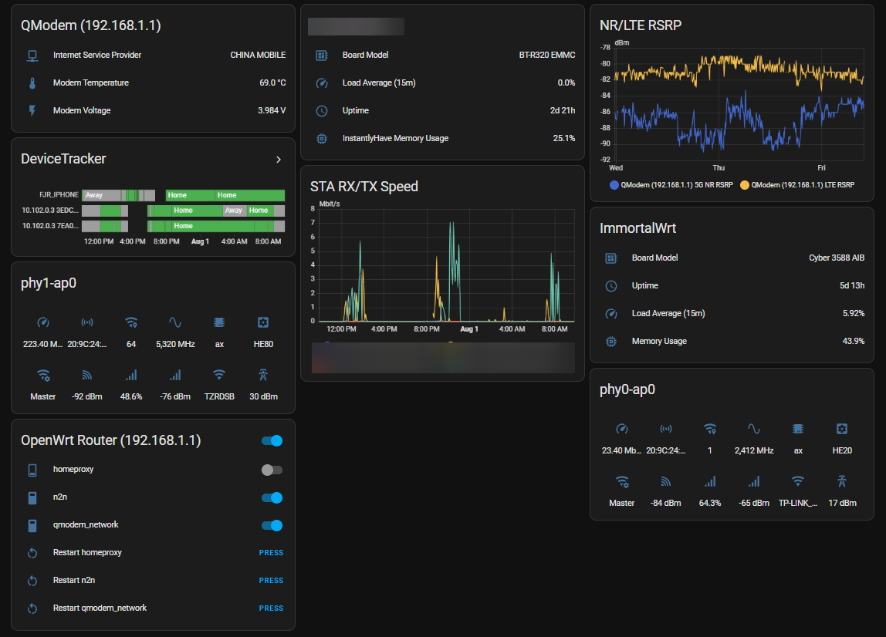
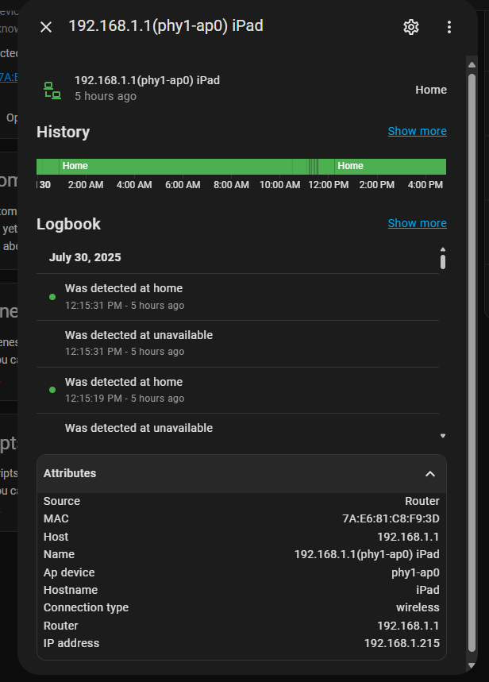
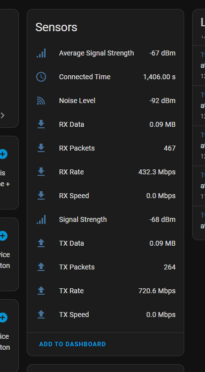
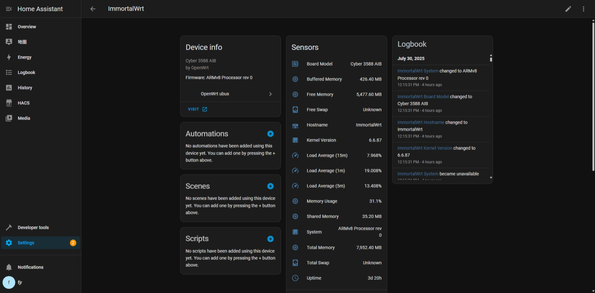
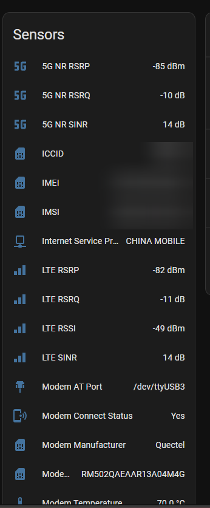
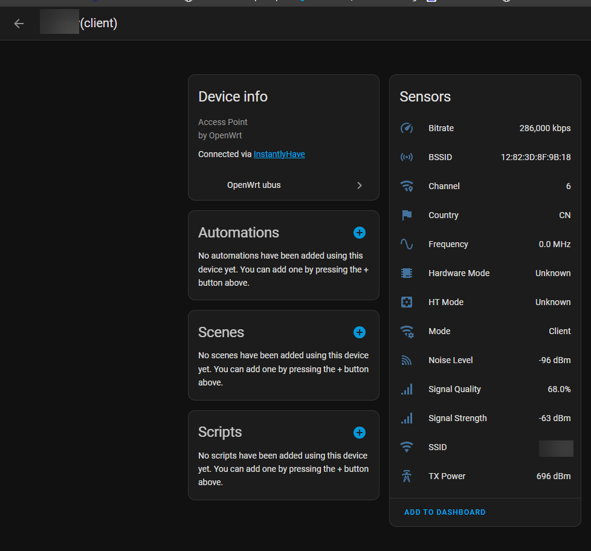
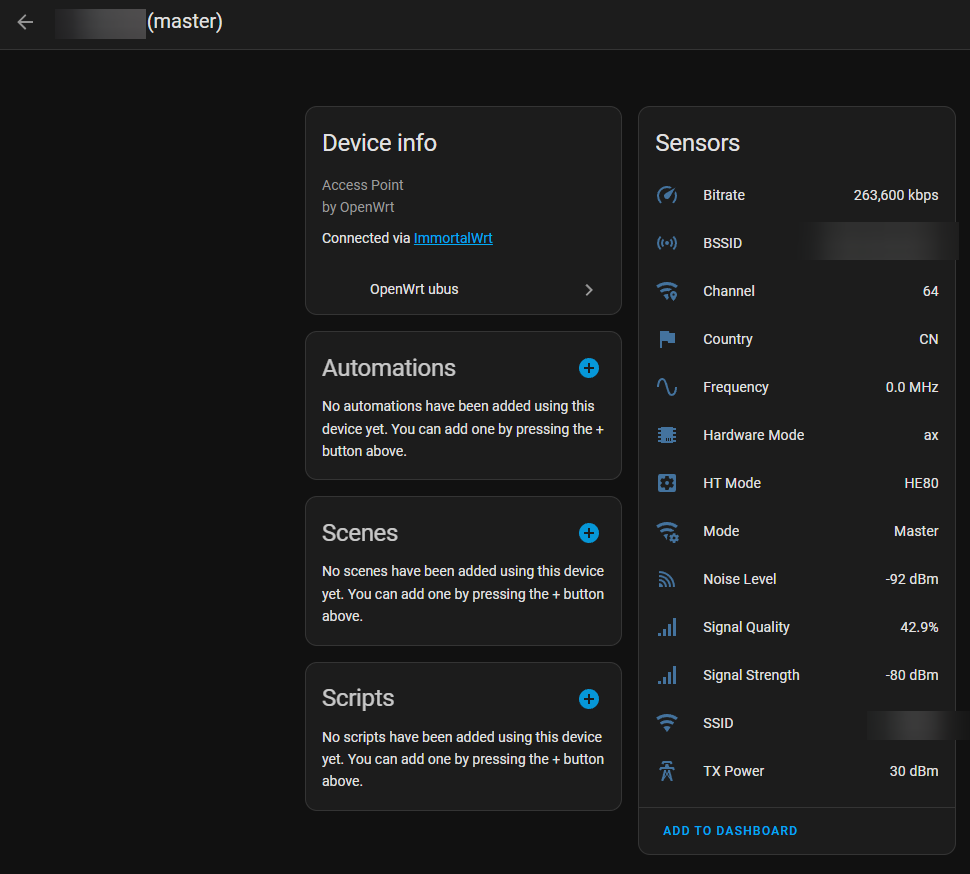
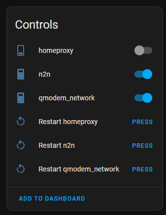
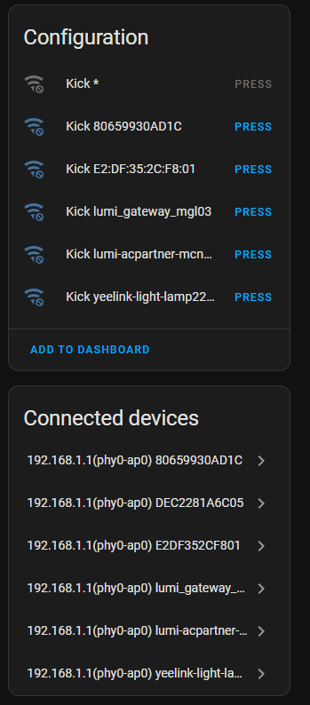
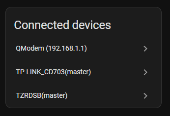

# OpenWrt Ubus Integration for Home Assistant

[](https://github.com/FUjr/homeassistant-openwrt-ubus/actions/workflows/hassfest.yml)
[](https://github.com/FUjr/homeassistant-openwrt-ubus/actions/workflows/validate.yml)

[中文版本](README_zh.md) | **English Version**

> **📝 AI-Generated Documentation Notice**  
> This README is primarily generated and enhanced by AI to provide comprehensive documentation. We welcome contributions from the community to improve and refine this documentation. Your feedback and suggestions are highly valued!

## 🚀 Overview

The OpenWrt Ubus Integration is a comprehensive Home Assistant custom integration that transforms your OpenWrt router into a powerful smart home hub. By leveraging OpenWrt's native ubus interface, this integration provides real-time device tracking, system monitoring, and advanced network management capabilities directly within Home Assistant.


*Complete overview of OpenWrt Ubus integration features in Home Assistant*

## 🎯 Features Overview

This integration provides the following comprehensive features:

### 1️⃣ AP Interface Management
Monitor and manage OpenWrt access point (AP) interfaces with detailed status information:
- **� AP Master Mode**: View hosted wireless networks with SSID, encryption, channel information, connected client counts, and bandwidth utilization
- **📶 AP Client Mode**: Monitor connection to upstream wireless networks with signal strength, data rates, and connection quality metrics
- **🔧 Real-time Status**: Live updates of wireless standards (802.11n/ac/ax), channel width, and connection stability
- **📊 Performance Metrics**: Track data throughput, signal quality, and interference levels

### 2️⃣ STA Device Management  
Comprehensive management of devices connected to AP interfaces:
- **🏷️ Device Identification**: Display hostname, MAC address, IP assignment, and connection duration
- **📶 Signal Monitoring**: Real-time signal strength (RSSI), connection quality, and data rate tracking
- **⏱️ Connection Metrics**: Monitor connection time, authentication status, and roaming behavior
- **🚫 Device Control**: Kick/disconnect unwanted clients using hostapd wireless service (requires hostapd installation)
- **🔄 Dynamic Discovery**: Automatic detection and entity creation for newly connected devices

### 3️⃣ STA Device Tracker
Create individual device tracker entities for each connected station:
- **� Presence Detection**: WiFi-based home/away detection for each connected device
- **📍 Location Tracking**: Identify which AP interface each device is connected to
- **⚡ Real-time Updates**: Instant status changes when devices connect or disconnect
- **🔗 Device Association**: Proper device relationships showing connected devices under their respective AP interfaces

### 4️⃣ System Management
Monitor and control OpenWrt system resources and services:
- **📊 System Information**: Track uptime, CPU usage, memory utilization (total/free/cached/buffer), and load averages (1/5/15 min)
- **🎛️ Service Control**: Start, stop, enable, disable, and restart system services managed by procd
- **🔧 Service Monitoring**: Real-time status monitoring of critical services like dnsmasq, dropbear, firewall, network, uhttpd, wpad
- **📈 Performance Tracking**: Continuous monitoring of system health metrics and resource utilization

### 5️⃣ QModem Management
Monitor 4G/5G cellular modem information managed by QModem:
- **📶 Signal Quality**: Track signal strength, quality indicators, and network registration status
- **🌡️ Modem Health**: Monitor temperature, power levels, and operational status
- **📊 Connection Stats**: View data usage, connection uptime, and network operator information
- **🔗 Network Details**: Display cell tower information, network technology (4G/5G), and connection modes

### 6️⃣ Via Device Implementation
Proper device hierarchy with via_device relationships:
- **🏠 Router Level**: Main router device showing all connected AP interfaces and QModem as sub-devices
- **📡 AP Interface Level**: Each AP interface as a device showing all connected STA devices
- **📱 Device Navigation**: Easy navigation between router → AP interface → connected devices in Home Assistant UI
- **🔗 Logical Grouping**: Intuitive device organization matching real network topology

## 📥 Installation & Setup

### Prerequisites ✅

Before installing the integration, ensure your OpenWrt router meets these requirements:

**Required Packages:**
```bash
# Install essential packages on your OpenWrt router
opkg install rpcd uhttpd-mod-ubus luci-app-uhttpd

# For device kick functionality (optional)
opkg install hostapd
```

**Required Services:**
```bash
# Enable required services
service rpcd start && service rpcd enable
service uhttpd start && service uhttpd enable
```

**Router Configuration:**
- 🔧 `rpcd` service running (handles ubus JSON-RPC)
- 🌐 `uhttpd` with ubus support (web interface backend)
- 🔐 Valid user credentials with appropriate permissions
- 🌍 Network access from Home Assistant to router

### Installation Methods

#### Method 1: Manual Installation

1. **📂 Download**: Clone or download this repository
   ```bash
   git clone https://github.com/FUjr/homeassistant-openwrt-ubus.git
   ```

2. **📋 Copy Files**: Copy the integration to your Home Assistant
   ```bash
   cp -r homeassistant-openwrt-ubus/custom_components/openwrt_ubus /config/custom_components/
   ```

3. **🔄 Restart**: Restart Home Assistant

4. **⚙️ Configure**: Go to **Settings** → **Devices & Services** → **Add Integration**

5. **🔍 Search**: Look for "OpenWrt ubus" and follow the setup wizard

#### Method 2: HACS Installation (Recommended) 🌟

> **Note**: This integration is available as a custom HACS repository

1. **➕ Add Repository**: In HACS, go to **Integrations** → **⋮** → **Custom repositories**
   
2. **📦 Install**: Add `https://github.com/FUjr/homeassistant-openwrt-ubus` as Integration

3. **⬇️ Download**: Search for "OpenWrt ubus" and install

4. **🔄 Restart**: Restart Home Assistant

5. **⚙️ Setup**: Add the integration through **Settings** → **Devices & Services**

### Router Permissions Setup 🔐

For enhanced functionality (hostname resolution), configure ACL permissions:

#### Create ACL Configuration
```bash
# SSH into your OpenWrt router
ssh root@your_router_ip

# Create ACL directory
mkdir -p /usr/share/rpcd/acl.d

# Create ACL file for Home Assistant
cat > /usr/share/rpcd/acl.d/root.json << 'EOF'
{
  "root": {
    "description": "Root user full access to ubus",
    "read": {
      "ubus": {
        "*": ["*"]
      }
    },
    "write": {
      "ubus": {
        "*": ["*"]
      }
    }
  }
}

EOF

# Restart services to apply changes
/etc/init.d/rpcd restart && /etc/init.d/uhttpd restart
```

> **Important**: Without ACL configuration, device names may appear as MAC addresses instead of hostnames.

## 🎛️ Features & Configuration

### Initial Setup 🛠️

1. **Navigate to Integration**: Go to **Settings** → **Devices & Services** → **Add Integration**
2. **Search and Add**: Search for "OpenWrt ubus" and click to add
3. **Configure Connection**: Enter your router details

### Configuration Options 📋

| Option | Description | Default | Available Options |
|--------|-------------|---------|------------------|
| 🏠 **Host** | Router IP address | - | Any valid IP address |
| 👤 **Username** | Login username | - | Usually 'root' |
| 🔑 **Password** | Login password | - | Router admin password |
| 📡 **Wireless Software** | Wireless monitoring method | iwinfo | iwinfo, hostapd, none |
| 🌐 **DHCP Software** | DHCP client detection | dnsmasq | dnsmasq, odhcpd, none |
| ⏱️ **System Timeout** | System data fetch timeout | 30s | 5s-300s |
| 📊 **QModem Timeout** | QModem data fetch timeout | 30s | 5s-300s |
| ⚙️ **Service Timeout** | Service control timeout | 30s | 5s-300s |
| 🚫 **Device Kick Buttons** | Enable device kick functionality | Disabled | Enabled/Disabled |

---

### 📱 Device Tracking & Station Management

The integration provides comprehensive device tracking and management for all devices connected to your OpenWrt router.


*Device tracker entities showing connected wireless devices with real-time status*

#### Wireless Device Detection
- **iwinfo Method**: Uses OpenWrt's iwinfo to detect wireless clients with system-level monitoring
- **hostapd Method**: Connects directly to hostapd daemon for real-time updates and kick functionality
- **Real-time Status**: Live updates when devices connect/disconnect with connection state tracking
- **Device Attributes**: MAC address, hostname, signal strength, connection time, and AP association

#### DHCP Client Monitoring
- **dnsmasq Integration**: Monitors DHCP leases from dnsmasq server with lease file parsing
- **odhcpd Support**: Compatible with odhcpd DHCP server for IPv6 and modern DHCP features
- **Lease Information**: IP addresses, hostnames, lease expiration, and client identification
- **Automatic Discovery**: Automatically detects new DHCP clients and creates tracking entities

**STA Device Features:**
- ✅ Real-time connection status updates with sub-second response
- 🏷️ Hostname resolution (with proper ACL configuration)
- 📍 Device location tracking (which AP interface they're connected to)
- ⏰ Connection duration tracking with historical data
- 🔄 Automatic entity creation for new devices with proper naming
- 📶 Signal strength monitoring with RSSI values and quality metrics

#### Connected Device Information Sensors


*Wireless station sensors showing signal strength and connection quality*

For each connected device, the integration creates detailed sensor entities:

**Station Sensors Include:**
- **Signal Strength (RSSI)**: Real-time signal power measurements
- **Connection Quality**: Link quality percentage and stability metrics
- **Data Rates**: Current TX/RX rates and maximum supported speeds
- **Connection Duration**: Time since device connected to the network
- **Authentication Status**: Security protocol and encryption information
- **AP Interface**: Which access point the device is connected to

---

### 📊 System Monitoring & Health

Comprehensive system health and performance monitoring for your OpenWrt router.


*System sensors displaying uptime, memory usage, and load averages*

#### System Information Sensors
The integration provides essential system monitoring with the following sensors:

- `sensor.openwrt_uptime` - System uptime and boot time tracking
- `sensor.openwrt_load_1` - 1-minute load average for CPU utilization
- `sensor.openwrt_load_5` - 5-minute load average for medium-term trends  
- `sensor.openwrt_load_15` - 15-minute load average for long-term patterns
- `sensor.openwrt_memory_total` - Total system memory available
- `sensor.openwrt_memory_free` - Current free memory amount
- `sensor.openwrt_memory_available` - Available memory for applications
- `sensor.openwrt_memory_buffers` - Memory used for buffers
- `sensor.openwrt_memory_cached` - Memory used for file system cache

#### QModem LTE/4G/5G Support
Monitor cellular modem status for routers with LTE/4G/5G capabilities.


*QModem sensors showing LTE signal strength, connection status, and data usage*

**QModem Sensors Include:**
- **Signal Strength & Quality**: RSSI, SINR, and signal quality indicators
- **Connection Status**: Registration state, connection uptime, and network availability
- **Data Usage Statistics**: Transmitted and received data volumes
- **Network Information**: Operator name, cell tower ID, and technology type (4G/5G)
- **Modem Health**: Temperature monitoring and operational status
- **Connection Details**: IP address assignment and connection mode information

---

### 🌐 Access Point Management & Control

Monitor and manage wireless access points with detailed status information and control capabilities.

#### AP Client Mode

*Access Point in client mode - connected to upstream wireless network*

**Client Mode Features:**
- **Upstream Connection**: Monitor connection to parent access point
- **Signal Metrics**: Signal strength (RSSI) and quality to upstream AP
- **Performance Data**: Current data rates and connection stability
- **Network Information**: Connected SSID, channel, and security protocol
- **Roaming Support**: Track handoffs between upstream access points

#### AP Master Mode

*Access Point in master mode - hosting wireless network for clients*

**Master Mode Features:**
- **Connected Clients**: Real-time count of associated wireless devices
- **Channel Information**: Current channel, width, and interference levels
- **Network Configuration**: SSID, encryption type, and security settings
- **Performance Metrics**: Bandwidth utilization and throughput statistics
- **Coverage Analysis**: Signal propagation and coverage quality data

---

### 🎛️ Service Control & System Management

Comprehensive service management for OpenWrt system services with real-time status monitoring and control.


*Service control switches and buttons for managing OpenWrt system services*

#### Switch Entities
- **Service Switches**: Toggle services on/off with real-time status feedback
- **Live Status Monitoring**: Shows current running state of each monitored service
- **Batch Status Updates**: Efficient monitoring of multiple services simultaneously using optimized API calls
- **State Synchronization**: Automatic status refresh to maintain consistency with router state

#### Button Entities
The integration provides granular service control through dedicated button entities:

- **🟢 Start Service**: Start a stopped service with immediate status feedback
- **🔴 Stop Service**: Stop a running service with graceful shutdown
- **✅ Enable Service**: Enable service to start automatically on system boot
- **❌ Disable Service**: Disable auto-start on boot while preserving current state
- **🔄 Restart Service**: Restart a running service with minimal downtime

**Managed Services Include:**
Essential OpenWrt system services managed by procd:
- `dnsmasq` - DNS and DHCP server for network name resolution
- `dropbear` - Lightweight SSH server daemon for remote access
- `firewall` - Netfilter firewall configuration and management
- `network` - Network interface configuration and routing
- `uhttpd` - Web server for LuCI interface and ubus communication
- `wpad` - Wireless daemon for WPA/WPA2/WPA3 authentication
- `odhcpd` - DHCPv6 and IPv6 router advertisement daemon
- `rpcd` - RPC daemon for ubus JSON-RPC communication
- And many more system services based on your OpenWrt configuration...

**Service Management Features:**
- ⚡ Instant response to state changes with real-time feedback
- 🔄 Automatic status refresh after control operations
- 🛡️ Comprehensive error handling with detailed user feedback
- 📊 Optimized batch API calls for improved performance and reduced router load
- 🔍 Service dependency awareness for safe operation ordering

---

### 🔧 UCI Configuration Control (Advanced)

The integration also provides direct control over OpenWrt UCI configuration options via two Home Assistant services. This enables advanced use cases such as per-device internet toggles, dynamic firewall rules, and runtime configuration changes – all driven from Home Assistant.

#### `openwrt_ubus.uci_get`

Reads a UCI option value through ubus and can optionally store the result in a Home Assistant sensor entity.

**Fields:**

| Field | Required | Description |
|-------|----------|-------------|
| `config` | ✓ | UCI config name (e.g. `firewall`, `wireless`, `dhcp`) |
| `section` | optional | Section name or type/index (e.g. `block_user_7085c2` or `@rule[3]`) |
| `option` | optional | Option key to retrieve (e.g. `enabled`) |
| `target_entity_id` | optional | Sensor entity ID to update with the result (e.g. `sensor.block_user_7085c2_enabled`) |

**Example: store firewall rule status into a sensor**

```yaml
service: openwrt_ubus.uci_get
data:
  config: firewall
  section: block_user_7085c2
  option: enabled
  target_entity_id: sensor.block_user_7085c2_enabled
```

When `target_entity_id` is provided, the integration will update that entity's state with the retrieved UCI value (for example, `"0"` or `"1"`).

#### `openwrt_ubus.uci_set_commit`

Sets a UCI option value and immediately commits the change.

**Fields:**

| Field | Required | Description |
|-------|----------|-------------|
| `config` | ✓ | UCI config name |
| `section` | ✓ | Section name or type/index |
| `option` | ✓ | Option key to modify |
| `value` | ✓ | New value (string) |

**Example: enable a firewall rule (block a MAC address)**

```yaml
service: openwrt_ubus.uci_set_commit
data:
  config: firewall
  section: block_user_7085c2
  option: enabled
  value: "1"
```

**Example: disable the firewall rule (unblock)**

```yaml
service: openwrt_ubus.uci_set_commit
data:
  config: firewall
  section: block_user_7085c2
  option: enabled
  value: "0"
```

#### Example: Per-device Internet Toggle Using a Firewall Rule

You can combine the UCI services with a simple automation and template switch to create a per-device internet kill switch that uses a MAC-based firewall rule.

**1. Automation to keep sensor in sync with the firewall rule**

```yaml
automation:
  - alias: "Sync firewall state for user 7085C2"
    trigger:
      - platform: time_pattern
        minutes: "/1"
    action:
      - service: openwrt_ubus.uci_get
        data:
          config: firewall
          section: block_user_7085c2
          option: enabled
          target_entity_id: sensor.block_user_7085c2_enabled
```

**2. Template switch that uses the UCI-backed sensor for state and UCI calls for actions**

```yaml
switch:
  - platform: template
    switches:
      user_7085c2_internet:
        friendly_name: "User Internet 70:85:C2:89:EC:74"
        # ON = firewall rule disabled (0) = internet allowed
        value_template: >
          {{ is_state('sensor.block_user_7085c2_enabled', '0') }}
        turn_on:
          - service: openwrt_ubus.uci_set_commit
            data:
              config: firewall
              section: block_user_7085c2
              option: enabled
              value: "0"
        turn_off:
          - service: openwrt_ubus.uci_set_commit
            data:
              config: firewall
              section: block_user_7085c2
              option: enabled
              value: "1"
```

This pattern can be reused for additional firewall rules and devices by adjusting the `section`, `sensor` and `switch` names.

> **Note:** The UCI services require that the OpenWrt RPC user configured for this integration has ubus permissions to call `uci get`, `uci set` and `uci commit`.

---

### 🚫 Advanced Device Management & Control

Advanced device management capabilities including the ability to disconnect unwanted devices from your wireless network.


*Device kick buttons for disconnecting specific wireless clients*

#### Device Kick Functionality
Force disconnect connected wireless devices from your network with temporary access restriction.

**How Device Kick Works:**
1. **🔍 Auto Detection**: Automatically detects all connected wireless devices across all AP interfaces
2. **🆔 Dynamic Button Creation**: Creates individual kick buttons for each currently connected device
3. **✅ Intelligent Availability**: Buttons only appear and function when:
   - Target device is currently connected and active
   - hostapd service is running and accessible via ubus
   - Device is connected to a supported access point interface
   - User has appropriate permissions for device management
4. **⚡ Deauthentication Action**: Sends IEEE 802.11 deauthentication command to target device
5. **🕐 Temporary Access Ban**: Automatically prevents reconnection for 60 seconds
6. **🔄 Status Synchronization**: Refreshes device status immediately after kick action

#### Connected Devices Overview

*Comprehensive overview of all connected devices with management controls*

**Technical Requirements:**
- **📡 hostapd Service**: Must be installed, running, and accessible via ubus interface
- **🌐 Ubus Integration**: hostapd must be compiled with ubus support for device management
- **🔐 User Permissions**: Router user account must have appropriate ACL permissions for hostapd control

**Device Kick Button Details:**
- **Entity Naming**: `button.kick_[device_name]` or `button.kick_[mac_address]` for easy identification
- **Rich Attributes**: Each button includes device MAC, hostname, AP interface, signal strength, and connection time
- **Auto-Hide Behavior**: Buttons automatically disappear when target devices disconnect
- **Multi-AP Support**: Separate kick controls for devices on different access point interfaces
- **Safety Features**: Prevents accidental kicks with confirmation and logging

**Configuration & Setup:**
Device kick functionality is disabled by default for security. To enable:
1. Navigate to **Settings** → **Devices & Services** → **OpenWrt ubus**
2. Click **Configure** on the integration entry
3. Enable **Device Kick Buttons** option
4. Save configuration and restart integration
5. Ensure hostapd is properly installed and configured on your router

**Use Cases:**
- **🔒 Security**: Immediately disconnect suspicious or unauthorized devices
- **📶 Network Management**: Free up bandwidth by removing idle or problematic connections  
- **👨‍👩‍👧‍👦 Parental Control**: Temporarily restrict access for specific devices
- **🔧 Troubleshooting**: Force device reconnection to resolve connectivity issues

---

### 🔧 Advanced Configuration & Optimization

#### Timeout Settings
Fine-tune integration performance based on your network and router capabilities:

- **System Sensor Timeout**: How long to wait for system data collection (5-300 seconds)
  - *Recommended*: 30s for most routers, 60s for older hardware
- **QModem Timeout**: Timeout for LTE/4G/5G modem queries (5-300 seconds)  
  - *Recommended*: 30s for stable connections, 120s for weak signal areas
- **Service Timeout**: Timeout for service control operations (5-300 seconds)
  - *Recommended*: 30s for local operations, 60s for complex service chains

#### Performance Optimization Features
- **Intelligent Batch API Calls**: Multiple ubus calls combined into single requests for efficiency
- **Advanced Caching System**: Reduces redundant API calls with smart cache invalidation
- **Configurable Update Intervals**: Adjust polling frequencies per sensor type to balance data freshness with system load
- **Background Processing**: Non-blocking operations ensure Home Assistant responsiveness
- **Memory Optimization**: Efficient data structures and cleanup for long-term stability

#### Software Compatibility Matrix
- **Wireless Monitoring Options**: 
  - `iwinfo`: Standard OpenWrt wireless information (compatible with all setups)
  - `hostapd`: Direct hostapd integration (enables device kick functionality)
- **DHCP Integration Options**: 
  - `dnsmasq`: Traditional DHCP/DNS server (most common)
  - `odhcpd`: Modern DHCP server with IPv6 support
  - `none`: Disable DHCP monitoring (wireless-only tracking)
- **Service Management**: Automatically adapts to available procd-managed services

## 🔧 Troubleshooting & Support

### Common Issues & Solutions ⚠️

**🚫 Cannot Connect to Router**
- ✅ Verify the router IP address is correct and accessible from Home Assistant
- ✅ Confirm username and password credentials are valid
- ✅ Ensure `rpcd` and `uhttpd` services are running: `service rpcd status && service uhttpd status`
- ✅ Check firewall settings allow HTTP access to ubus (port 80/443)
- ✅ Test connectivity: `curl http://router_ip/ubus -d '{"jsonrpc":"2.0","method":"call","params":["00000000000000000000000000000000","session","login",{"username":"root","password":"your_password"}],"id":1}'`

**❌ No Devices Detected**
- ✅ Verify wireless software setting matches your OpenWrt configuration
- ✅ Check DHCP software setting corresponds to your DHCP server
- ✅ Ensure selected monitoring methods are properly configured on the router
- ✅ Test wireless detection: `iwinfo` or check hostapd status: `ubus call hostapd.wlan0 get_clients`
- ✅ Verify DHCP lease file accessibility: `ls -la /var/dhcp.leases /tmp/dhcp.leases`

**⏰ Sensors Not Updating**
- ✅ Check Home Assistant logs for connection errors: `Settings → System → Logs`
- ✅ Verify router permissions allow access to system information
- ✅ Test system data access: `ubus call system info && ubus call system board`
- ✅ Check network connectivity stability between Home Assistant and router
- ✅ Review timeout settings in integration configuration

**🏷️ Devices Show MAC Addresses Instead of Hostnames**
- ✅ Ensure hostname resolution ACL is properly configured (see [Router Permissions Setup](#router-permissions-setup-🔐))
- ✅ Verify DHCP lease files are accessible: `/var/dhcp.leases` or `/tmp/dhcp.leases`
- ✅ Check that the rpcd service has been restarted after ACL configuration: `/etc/init.d/rpcd restart`
- ✅ Confirm the user account is assigned to the correct ACL group
- ✅ Test file access: `ubus call file read '{"path":"/tmp/dhcp.leases"}'`

**🚫 Device Kick Buttons Not Working**
- ✅ Verify hostapd is installed and running: `service hostapd status`
- ✅ Check hostapd ubus integration: `ubus list | grep hostapd`
- ✅ Ensure device kick buttons are enabled in integration configuration
- ✅ Confirm target device is connected via hostapd-managed interface
- ✅ Test hostapd control: `ubus call hostapd.wlan0 del_client '{"addr":"device_mac","reason":5,"deauth":true,"ban_time":60000}'`

### Debug Logging & Diagnostics 🐛

Enable comprehensive logging for troubleshooting:

```yaml
# Add to configuration.yaml
logger:
  default: warning
  logs:
    custom_components.openwrt_ubus: debug
    custom_components.openwrt_ubus.extended_ubus: debug
    custom_components.openwrt_ubus.shared_data_manager: debug
    homeassistant.components.device_tracker: debug
```

**Log Analysis Tips:**
- **Connection Issues**: Look for "Failed to connect" or "Timeout" messages
- **Authentication Problems**: Search for "401" or "authentication failed" errors
- **Device Detection**: Check for "No devices found" or parsing errors
- **Service Control**: Monitor "Service operation failed" messages

### Performance Monitoring 📊

Monitor integration performance using built-in metrics:
- **API Response Times**: Check logs for slow ubus calls (>5 seconds)
- **Update Intervals**: Verify sensors update within expected timeframes
- **Error Rates**: Monitor for recurring connection or parsing errors
- **Memory Usage**: Ensure Home Assistant memory remains stable

## 👨‍💻 Development & Architecture

### Project Structure 📁
```
custom_components/openwrt_ubus/
├── __init__.py              # Main integration setup and coordinator management
├── config_flow.py           # User configuration flow with validation
├── const.py                 # Constants, defaults, and configuration schemas
├── device_tracker.py        # Device tracking platform implementation
├── sensor.py               # Sensor platform coordinator and entity management
├── switch.py               # Service control switches with real-time status
├── button.py               # Service control and device kick button coordination
├── extended_ubus.py        # Enhanced ubus client with batch API and hostapd support
├── shared_data_manager.py  # Centralized data management and caching optimization
├── manifest.json           # Integration manifest and dependencies
├── strings.json            # UI strings and user-facing text
├── services.yaml           # Service action definitions
├── Ubus/                   # Core ubus communication library
│   ├── __init__.py
│   ├── const.py           # ubus protocol constants
│   └── interface.py       # Low-level ubus interface implementation
├── buttons/                # Button entity modules
│   ├── __init__.py
│   ├── service_button.py   # Service control buttons (start/stop/restart/enable/disable)
│   └── device_kick_button.py # Device kick functionality with hostapd integration
├── sensors/                # Individual sensor platform modules
│   ├── __init__.py
│   ├── system_sensor.py    # System information sensors (uptime, memory, load)
│   ├── qmodem_sensor.py    # QModem/LTE sensors (signal, connection, data)
│   ├── sta_sensor.py       # Wireless station sensors (per-device metrics)
│   └── ap_sensor.py        # Access Point sensors (interface status)
└── translations/           # Localization files for multi-language support
    ├── en.json            # English translations
    └── zh.json            # Chinese translations
```

### Integration Architecture 🏗️

**Data Flow Architecture:**
1. **SharedDataUpdateCoordinator**: Central data management with batch API optimization
2. **ExtendedUbus**: Enhanced ubus client with hostapd integration and error handling
3. **Platform Modules**: Specialized sensor/entity implementations
4. **Caching Layer**: Intelligent caching with invalidation strategies

**Key Design Patterns:**
- **Coordinator Pattern**: Centralized data updates with entity subscriptions
- **Factory Pattern**: Dynamic entity creation based on detected devices/services
- **Observer Pattern**: Real-time updates with minimal API calls
- **Strategy Pattern**: Configurable wireless/DHCP detection methods

### Contributing Guidelines 🤝

1. **🍴 Fork the Repository**: Create your own fork for development
2. **🌿 Create Feature Branch**: Use descriptive branch names (`feature/device-kick-improvements`)
3. **✏️ Code Quality**: Follow Home Assistant development guidelines
4. **🧪 Test Thoroughly**: Test with various OpenWrt configurations
5. **� Document Changes**: Update README and code comments
6. **�📤 Submit Pull Request**: Provide detailed description of changes

**Development Setup:**
- Test with multiple OpenWrt versions (21.02, 22.03, snapshot)
- Verify compatibility with different wireless drivers (ath9k, ath10k, mt76)
- Test various hardware platforms (MIPS, ARM, x86)

## 📄 License

This project is licensed under the Mozilla Public License 2.0 (MPL-2.0) - see the LICENSE file for details.

## 🆘 Support & Community

- **🐛 GitHub Issues**: [Report bugs or request features](https://github.com/fujr/homeassistant-openwrt-ubus/issues)
- **💬 Home Assistant Community**: [Discuss on the forum](https://community.home-assistant.io/)
- **📖 OpenWrt Documentation**: [Official OpenWrt Wiki](https://openwrt.org/docs/start)
- **🔧 ubus Reference**: [OpenWrt ubus Documentation](https://openwrt.org/docs/techref/ubus)

## 🙏 Acknowledgments

- **🔧 OpenWrt Project**: For providing excellent open-source router firmware with powerful APIs
- **🏠 Home Assistant Community**: For integration development resources, testing, and feedback
- **👥 Contributors & Testers**: Community members who help improve this integration through bug reports, feature requests, and code contributions
- **📚 Documentation Contributors**: Special thanks to contributors helping improve and refine this documentation

---

> **📝 Documentation Contributions Welcome!**  
> This README benefits greatly from community input. If you find areas for improvement, unclear instructions, or missing information, please contribute through issues or pull requests. Your experience and feedback help make this integration better for everyone!
